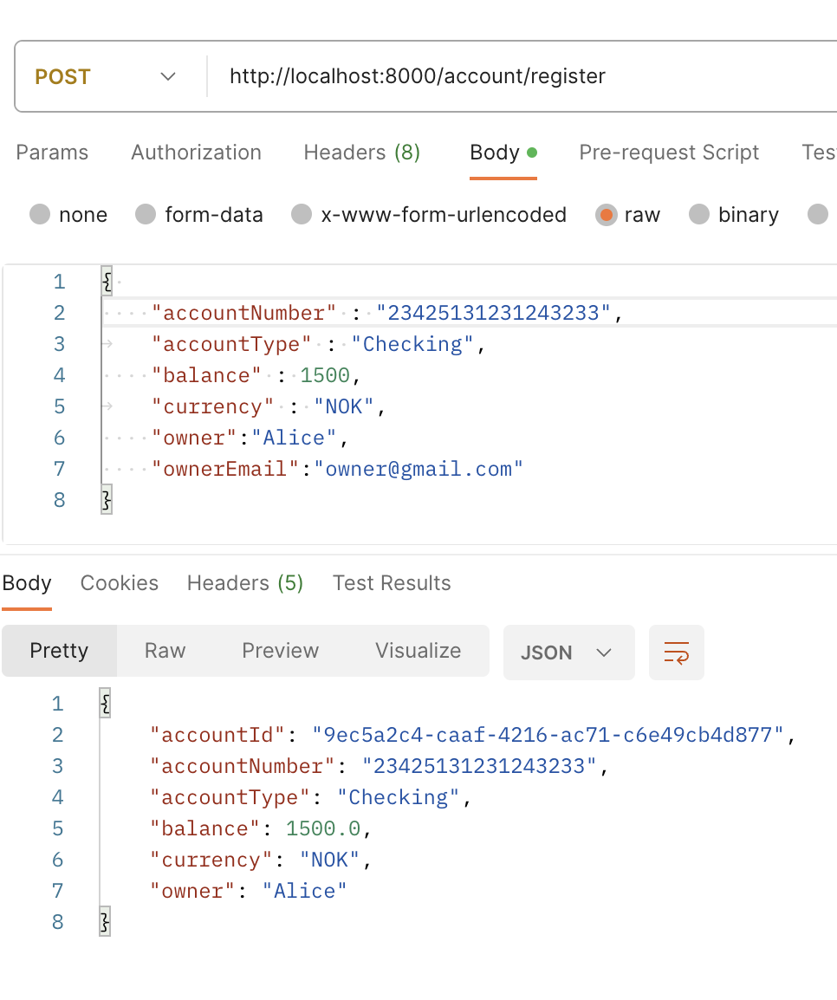

# Budgetor

## Getting started

### Prerequisites

- Java Development Kit (JDK) 8 or higher
- Apache Maven
- MySQL Database Server

## Installation

1. Clone the repository and configure application.properties file as shown blow:

   ````server.port=8000
   spring.datasource.url=jdbc:mysql://localhost:3306/budgetor
   spring.datasource.username=[your-database]
   spring.datasource.password=[your-database-password]
   spring.datasource.driver-class-name=com.mysql.cj.jdbc.Driver
   spring.jpa.properties.hibernate.dialect=org.hibernate.dialect.MySQL8Dialect
   spring.jpa.hibernate.ddl-auto= update```

   ````

2. Navigate to the project directory and then run the following commands:

- cd Budgetor

- mvn clean package
- java -jar target/Budgetor-0.0.1-SNAPSHOT.jar

- The API Endppoints owill be accessible at http://localhost:8000

##### Use either a tool like Postman or a web browser to test different API Endpoints

## Images that show how the API Endpoints should be used

### A list of API Endpoints


### A bunch of other usefull images that show how the API Endpoint work:





## Additional configurations (optional)

### Gmail configuration in Config class


### MilestoneService class


## Technology Stack:

1. Java
2. Spring boot
3. MySQL
4. Maven

#### Additional notes

- There are many other API Endpoints that are not included in the images
- Take a look at the source code for a better understanding
